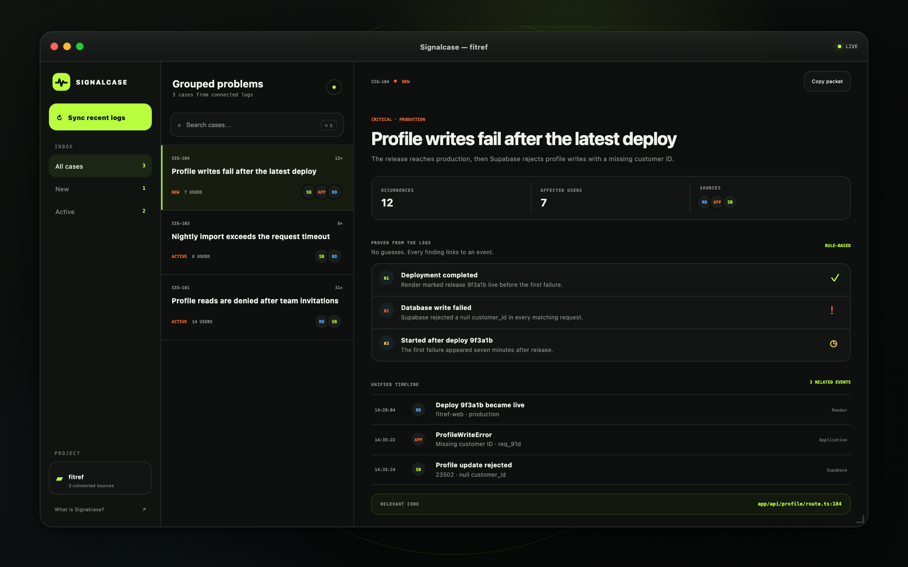

# Signalcase

[](https://github.com/prioneto/signalcase/actions/workflows/ci.yml)
[](LICENSE)

Signalcase is a free, open-source native macOS app that turns logs from Supabase, Render, GitHub, and your application into compact, evidence-backed bug cases. No payment, no ads, no AI account — grouping and findings are deterministic rules.



Demo: [signalcase.vercel.app](https://signalcase.vercel.app) — the website with an interactive preview on sample data.

- **Run it:** host your own server and build the Mac app — see [Self-hosting](docs/SELF_HOSTING.md)
- Found a security issue? See [SECURITY.md](SECURITY.md). Contributions welcome — start with [CONTRIBUTING.md](CONTRIBUTING.md)

Signalcase only uses connected or imported live data.

## Native app

Signalcase has no hosted service: the app signs in to a Signalcase server you run (Next.js + Supabase). Set that up first with the [self-hosting guide](docs/SELF_HOSTING.md), then build the app against it.

Requires macOS 14+ and [Xcode](https://apps.apple.com/app/xcode/id497799835) (or a Swift 5.10+ toolchain).

```bash
git clone https://github.com/prioneto/signalcase.git
cd signalcase/macOS
cp .env.build.example .env.build   # your server URL and Supabase public values
./scripts/build-app.sh --open
```

The packaged app is created at `macOS/.build/Signalcase.app`. Apps built locally run without Gatekeeper prompts — no Apple Developer account or notarization needed. The build script stops with "Missing public app configuration" until `.env.build` is filled in.

Try these flows:

- In onboarding or Settings, sign in with GitHub and create or select a Signalcase project. Cases and status changes are shared with every workspace member.
- Open **Connections** and click **Connect Supabase**. Authorization opens in the user's default browser and returns through the app's secure callback. Signalcase then retrieves the accessible Supabase projects and lets the user choose one; no project reference or access token is pasted into the app. Provider tokens are encrypted on the server.
- Render credentials currently use macOS Keychain. Prefer the narrowest read-only permissions available.
- Click **Sync recent logs**, choose connected sources and a window, then let Signalcase detect cases. Provider pages and temporary rate limits are handled automatically.
- Enable **Automatic sync** in Settings to incrementally check connected pull-based sources every 5, 15, 30, or 60 minutes while Signalcase is open.
- Import a JSON, JSONL, or plain-text log file from the sync sheet.
- Advance a case from New → Active → Resolved. The server keeps status changes synchronized across Macs and reopens a resolved case when newer evidence arrives.
- Open **Team** to invite members, copy seven-day invite links, change roles, or remove access. Signalcase is free — there is nothing to purchase.

### Sources

- **Supabase:** Management OAuth with `projects:read` and `analytics:read`. Signalcase lists accessible projects, saves the user's selection, and queries the current Management API unified `logs` endpoint through its server.
- **Render:** workspace owner ID, service IDs, and an API key. Service logs and deploys are read.
- **Application Logs:** an authenticated endpoint on your server collects structured production errors while every Mac is offline. The same secret can also feed an optional localhost receiver during development.
- **GitHub:** a GitHub App installation grants repository-scoped read access to failed Actions runs and source context.

## Website

```bash
cd website
npm install
npm run dev
```

Open [http://localhost:3002](http://localhost:3002). Requires Node.js 22.13+.

Without backend variables the website runs as the static demo, like [signalcase.vercel.app](https://signalcase.vercel.app). Account linking and provider OAuth need the values listed in `website/.env.example`; see [Self-hosting](docs/SELF_HOSTING.md) for the Supabase, Vercel, and native distribution steps.

## Repository layout

| Path | Contents |
| --- | --- |
| `macOS/` | SwiftUI app (Swift package), build script, and tests |
| `website/` | Next.js website, demo, dashboard, and API routes |
| `supabase/migrations/` | Database schema, applied in filename order |
| `docs/` | Self-hosting guide and release checklist |

## Current boundary

Supabase, GitHub, Application Logs, shared cases, and teams go through your Signalcase server. Render currently uses a project-scoped API key stored in macOS Keychain. Provider retention and API limits still apply.

## License

Copyright © 2026 Signalcase contributors.

This project is licensed under the [GNU Affero General Public License v3.0](LICENSE) — free to use, study, modify, and self-host. If you run a modified version as a network service, you must offer your modified source to its users (AGPL section 13).
